[![LinkedIn][linkedin-shield]][linkedin-url]

[linkedin-shield]: https://img.shields.io/badge/-LinkedIn-black.svg?style=for-the-badge&logo=linkedin&colorB=555
[linkedin-url]: https://www.linkedin.com/in/evanderchristiandumalang/

# Trade App

Trade App using Finnhub Stocks API (https://finnhub.io/)

### Built With

* [![Dart][Dart.dev]][Dart-url]
* [![Flutter][Flutter.dev]][Flutter-url]
* [![Firebase][Firebase.google.com]][Firebase-url]

[Dart.dev]: https://img.shields.io/badge/Dart-FFFFFF?style=for-the-badge&logo=dart&logoColor=cyan
[Dart-url]: https://dart.dev/
[Flutter.dev]: https://img.shields.io/badge/Flutter-FFFFFF?style=for-the-badge&logo=flutter&logoColor=cyan
[Flutter-url]: https://flutter.dev/
[Firebase.google.com]: https://img.shields.io/badge/Firebase-FFFFFF?style=for-the-badge&logo=firebase&logoColor=yellow
[Firebase-url]: https://firebase.google.com/

## Documentation

### App Preview

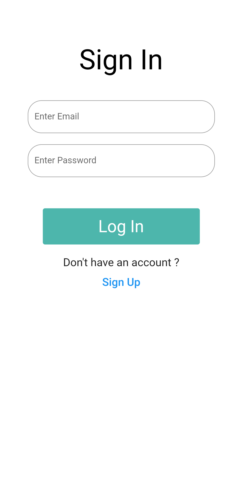 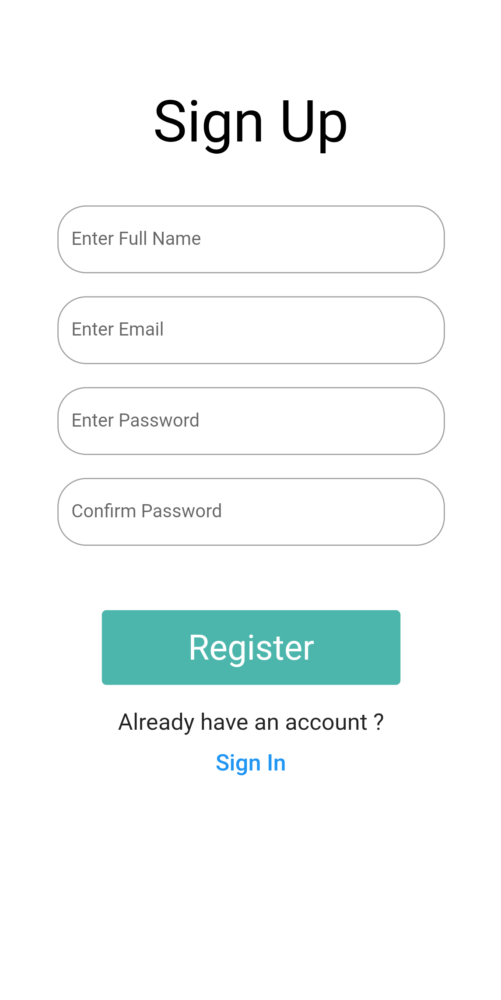 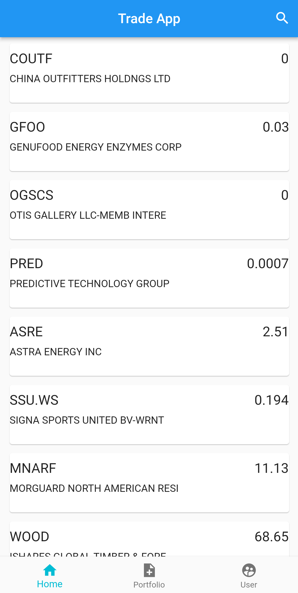 
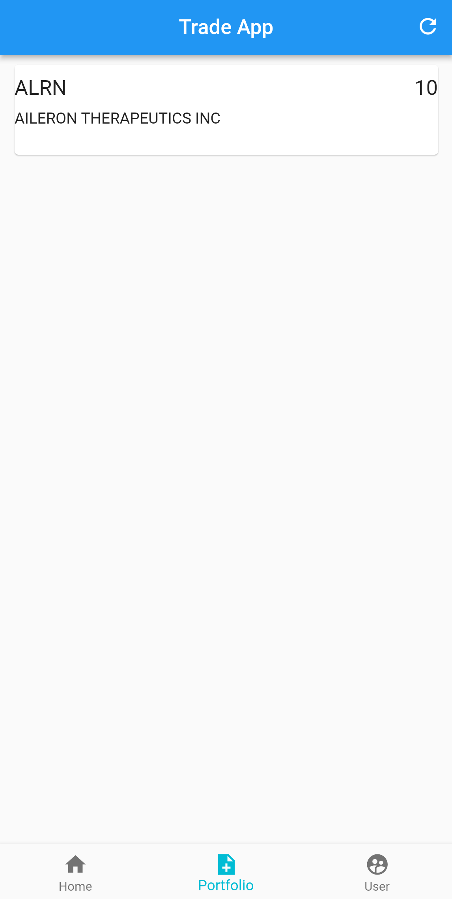

 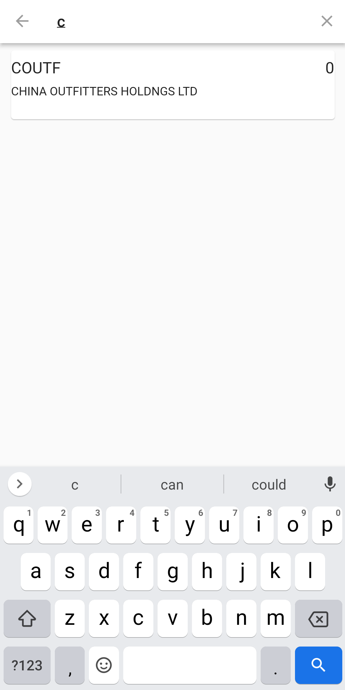 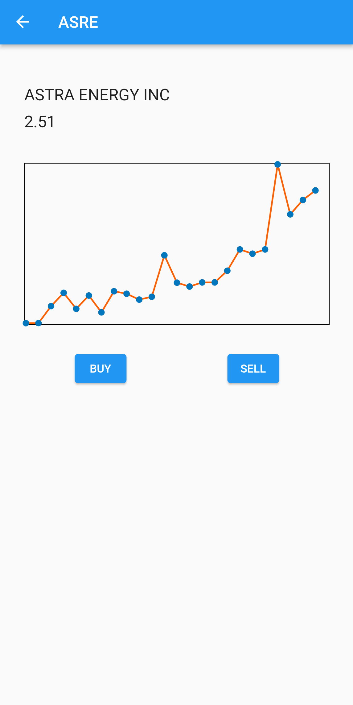 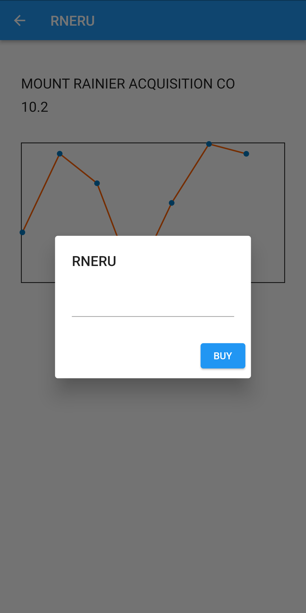 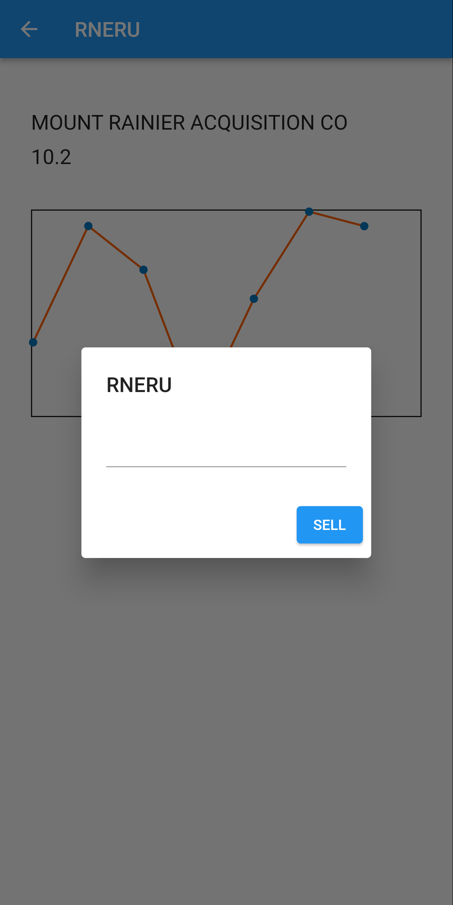

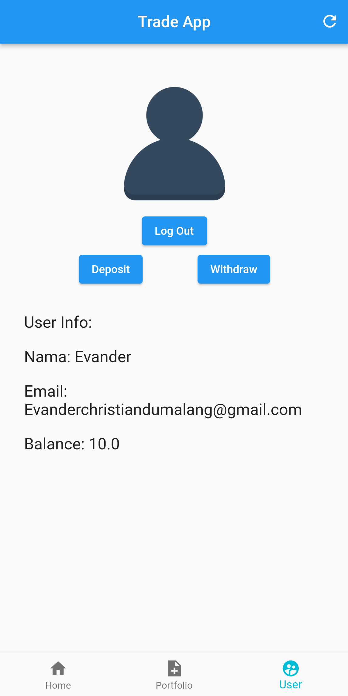 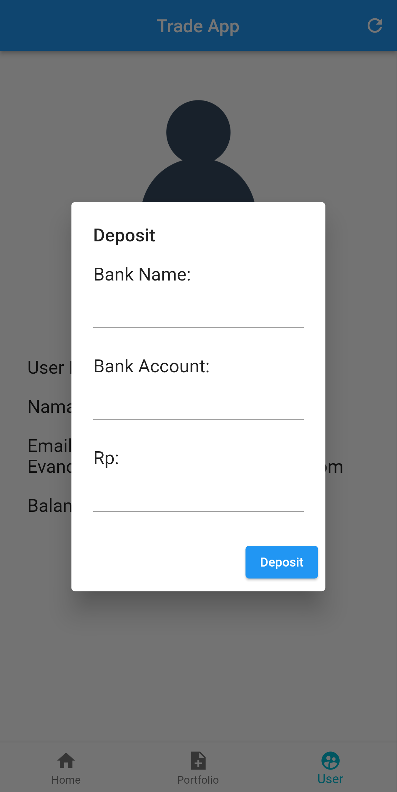 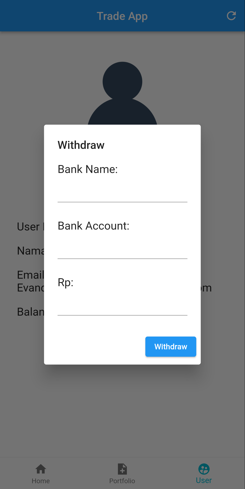

### Demo

## Installation

- Add [Flutter](https://flutter.dev/docs/get-started/install) to your machine

- Open this project folder with Terminal/CMD and run `flutter packages get`

- Run `flutter run` to build and run the debug app on your emulator/phone

## Contributing

Contributions are what make the open source community such an amazing place to learn, inspire, and create. Any contributions you make are **greatly appreciated**.

If you have a suggestion that would make this better, please fork the repo and create a pull request.

## License

All the code available under the MIT licenses. See [LICENSE](LICENSE).
